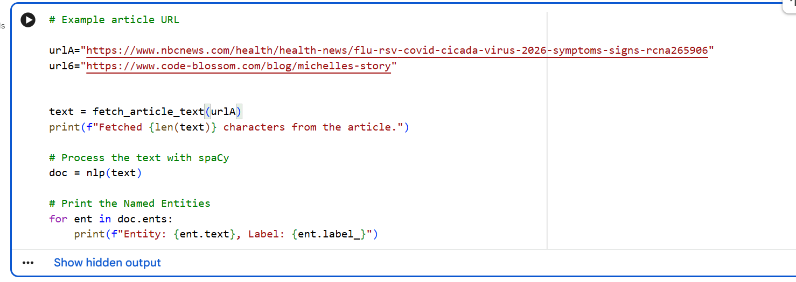

# Natural language processing Practice exercise
 
# Introduction 
This assignment focuses on applying Natural Language Processing (NLP) techniques to analyze text data using spaCy. The main objective is to explore how computers understand human language by performing Named Entity Recognition (NER), Part of Speech (POS) tagging, and speech-to-text conversion. These techniques help in extracting meaningful information from text and audio data.

# Articles Used 
The article used for this assignment was obtained from an online source and contains information about technology and health. The text was selected because it includes names of people, organizations, and locations, making it suitable for testing NLP techniques.

 

# Test 1: Name Entity Recognition
Named Entity Recognition was performed using spaCy to identify and classify key entities in the text such as people, organizations, and locations. The model successfully extracted entities like names of individuals, countries, and companies from the article.

# Output

# Test 2: Part of Speech tagging
Part of Speech tagging was applied to label each word in the text according to its grammatical role, such as nouns, verbs, and adjectives.spaCy was able to correctly identify most of the word categories, helping to understand the structure of sentences in the article. As shown below,

# Output

# Test 3: Speech to text
Speech-to-text conversion was performed by recording audio and converting it into written text. The system was able to transcribe the spoken words into text with reasonable accuracy, although minor errors may occur due to pronunciation or background noise.
# Input and Output

# Conclusion
In conclusion, this assignment demonstrated how NLP techniques can be used to analyze both text and audio data. spaCy proved to be effective for performing Named Entity Recognition and Part of Speech tagging, while speech-to-text tools enabled audio processing. 

# Group Members
Esther Kondowe  BIT/22/SS/015,
George Dambo    BIT/21/SS/008,
Patrick Magule  BIT/21/SS/020,
Rexious Huka    BIT/22/SS/009

